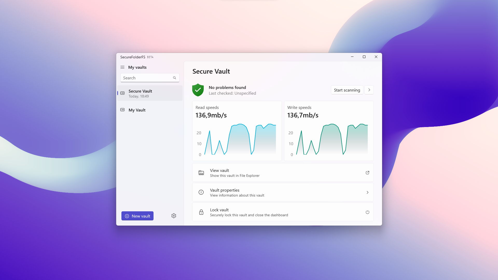
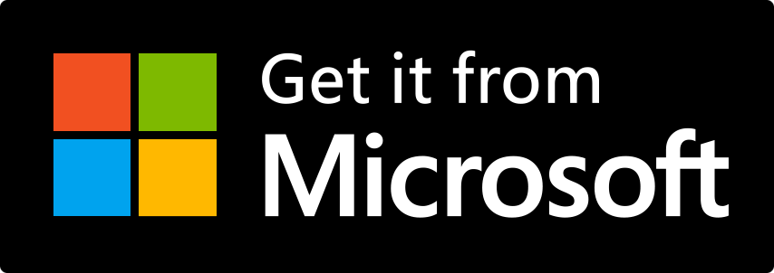

  <h1 align="center">SecureFolderFS</h1>

  

### About

SecureFolderFS helps you keep your files private. Safeguard your data with cutting-edge cryptographic algorithms that seamlessly secure your data thanks to the on-fly encryption. Built from the ground up to be safe, our advanced file system engine ensures that only the specific sections of your data necessary for viewing are decrypted. This groundbreaking approach allows SecureFolderFS to achieve exceptional performance without sacrificing security.

When trust is broken, encryption is not. SecureFolderFS cannot provide anyone with the decryption keys to your vaults without your credentials (not even the authors). This ensures that your data will always stay secure.

> [!NOTE]
> The software is currently in the Beta stage which might have occasional stability issues. Developers are not responsible for the loss or corruption of data.

### Try out SecureFolderFS

You can also download from *[Releases (Source code only)](https://github.com/securefolderfs-community/SecureFolderFS/releases)*.
 
*More platforms including Android, iOS, and Linux are coming in the foreseeable future.*

### Translating and contributing to SecureFolderFS

You can update existing localization strings by heading to our *[Crowdin project page](https://crowdin.com/project/securefolderfs)*. To add a new language to the list, please request it to be added *[here](https://github.com/securefolderfs-community/SecureFolderFS/issues/50)*. New translations will be synced periodically to the main repository.

All contributions are welcome! Whether you want to suggest a new feature or report a bug, you can open a new *[Issue or Feature Request](https://github.com/securefolderfs-community/SecureFolderFS/issues/new/choose)*. Take a look at our *[Contributing Guidelines](CONTRIBUTING.md)* to learn about best practices when creating a new Pull Request.

Check out *[BUILDING](BUILDING.md)* to prepare your environment for developing SecureFolderFS.
