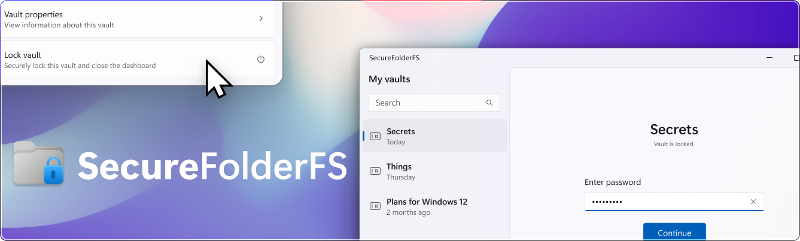
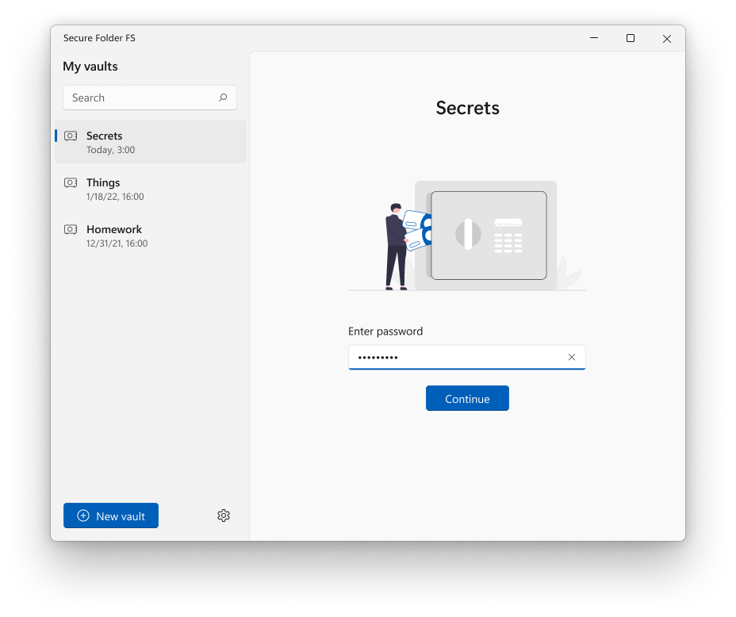
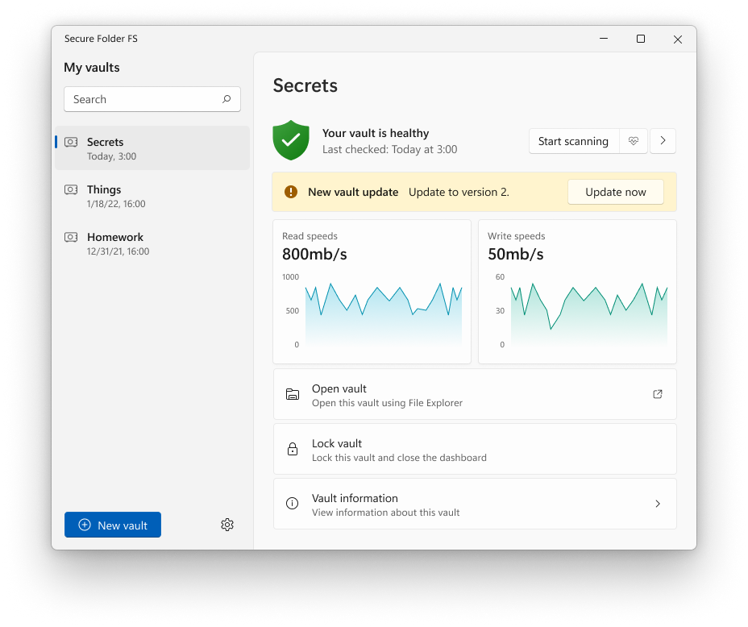
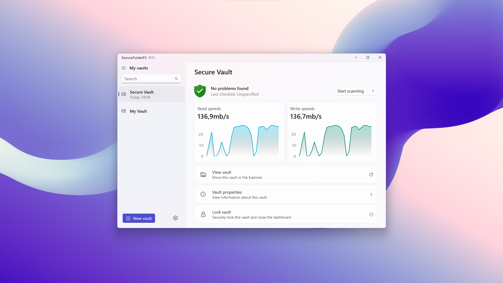

<p align="center">
  
</p>

<p align="center">
  <a style="text-decoration:none" href="https://github.com/securefolderfs-community/SecureFolderFS/releases/latest">
    
  </a>
  <!--<a style="text-decoration:none" href="https://github.com/securefolderfs-community/SecureFolderFS/actions/workflows/ci.yml">
    
  </a>-->
  <a style="text-decoration:none" href="https://crowdin.com/project/securefolderfs">
    
  </a>
  <a style="text-decoration:none" href="https://discord.gg/NrTxXpJ2Zj">
    
  </a>
</p>

SecureFolderFS helps you **keep your files private**.
Safeguard your data with **cutting-edge** cryptographic algorithms that **seamlessly secure** your data thanks to **on-the-fly encryption**.
**Built from the ground up** to be safe, our **advanced** file system engine ensures that only the specific sections of your data necessary for viewing are decrypted.
This **groundbreaking approach** allows SecureFolderFS to achieve **exceptional performance** without sacrificing security.

*When trust is broken, encryption is not.*
SecureFolderFS cannot provide anyone with the decryption keys to your vaults without your credentials *(not even the authors)*.
This ensures that your data will always stay secure.

---

## Try out SecureFolderFS

<p align="left">
	<a style="text-decoration:none" href="https://apps.microsoft.com/store/detail/securefolderfs/9NZ7CZRN7GG8" target="_blank">
		
	</a>
	<a style="text-decoration:none" href="https://github.com/securefolderfs-community/SecureFolderFS/releases/latest">
		
	</a>
</p>

### How to use SecureFolderFS

SecureFolderFS is a modern vault programme that helps you keep your files safe.
From the app's UI, you can create new vaults to store items securely.

<p align="center">
  
</p>

> *For example, the 'Secrets' vault is locked behind a password.*
> *You must enter the correct password, which was set when the vault was created, to decrypt and unlock the vault.*

<p align="center">
  
</p>

> *Upon entering the correct password, the vault will then open.*
> *You can press 'Open vault' to open the vault's mounted file-system in your file manager of choice.*
> *When you're done accessing your files, you can press the 'Lock vault' button and the vault file-system will close.*
> *The vault remains offline on your disk and your data is encrypted in a way that cannot be accessed by any programme, past, present or future.*

## Supported platforms

> [!NOTE]
> The purpose of SecureFolderFS is to provide a professional, usable 'safe folder' experience that supports all major platforms with a consistent feature set.
> SecureFolderFS can run on a huge range of devices (as supported by Uno Platform, MAUI and the .NET Runtime).

SecureFolderFS can run on the following platforms:
- Android, iOS and iPadOS: SecureFolderFS provides its encryption services across all modern mobile devices using Microsoft's MAUI platform.
- Windows: SecureFolderFS provides an extremely feature-rich experience on Windows, built from-the-ground-up using the Windows App SDK.
- macOS: SecureFolderFS lets you safeguard your data on macOS, with built-in support for Touch ID, made possible by Uno Platform.
- Linux: SecureFolderFS provides the same rich feature set that exists on other platforms to Linux devices.

## Contributing

All contributions are welcome!
Whether you want to suggest a new feature or report a bug, you can open a new *[issue or feature request](https://github.com/securefolderfs-community/SecureFolderFS/issues/new/choose)*.
Take a look at our *[contributing guidelines](CONTRIBUTING.md)* to learn about best practices when creating a new pull request.

## Translating

You can update existing localization strings by heading to our *[Crowdin project page](https://crowdin.com/project/securefolderfs)*.
To add a new language to the list, please request it to be added *[here](https://github.com/securefolderfs-community/SecureFolderFS/issues/50)*.
New translations will be synchronized periodically to the source code, and new releases will always contain the latest translations.

---

## Building from source

> Below are the instructions for building the cross-platform SecureFolderFS app (main app).
> For other projects, such as the SDK, libraries and CLI programme, you can build as normal with the latest .NET SDK, without the prerequisites listed below.

### 1. Prerequisites

- .NET 10 SDK
- [`Uno.Check`](https://platform.uno/docs/articles/uno-check.html)
- Git
- For Android builds:
  - Android SDK and platform tools (Android Studio)
  - JDK 17+
- For iOS builds:
  - Xcode 26.2 (on macOS)

### 2. Set up IDE

> *Using Visual Studio 2026 is recommended for SecureFolderFS development.*
> *Otherwise, you might see issues with the .NET SDK.*

##### Visual Studio

- Microsoft Visual Studio with .NET
- Workloads:
  - ".NET desktop development" (desktop target, including all platform SDKs)
  - ".NET multi-platform app UI development"
  - "WinUI application development"
- Uno Platform extension

##### Rider

> [!NOTE]
> Running the Windows App SDK version of SecureFolderFS (targetting `net10.0-windows10.0...`) is not supported in Rider.

- JetBrains Rider with .NET
- Android SDK/JDK (and Xcode SDK on macOS) are configured correctly in Rider settings (for mobile targets)

### 3. Run `Uno.Check`

> *This step is optional, but is good practice to check you installed all the necessary dependencies to build SecureFolderFS on your computer.*

Run the following command and follow all of its instructions (you need to have `Uno.Check` installed!)

```
uno-check
```

See the [official `Uno.Check` guide](https://platform.uno/docs/articles/uno-check.html) for tips.

### 4. Clone the repository

> [!WARNING]
> Ensure that you include the required submodules when cloning SecureFolderFS.
> Otherwise, you will run into issues as SecureFolderFS will not have all the dependencies it needs to build.

```bash
git clone --recursive https://github.com/securefolderfs-community/SecureFolderFS
cd SecureFolderFS
```

### 5. Build the project

- Open the solution `SecureFolderFS.Public.slnx`
- Set `SecureFolderFS.Uno` as the startup project if you are building for desktop targets (i.e. macOS, Linux or Windows)
- Set `SecureFolderFS.Maui` as the startup project if you are building for mobile targets (i.e. Android, iOS or iPadOS)
- Select the appropriate target device / platform
- Run with debugger

<p align="center">
  
</p>