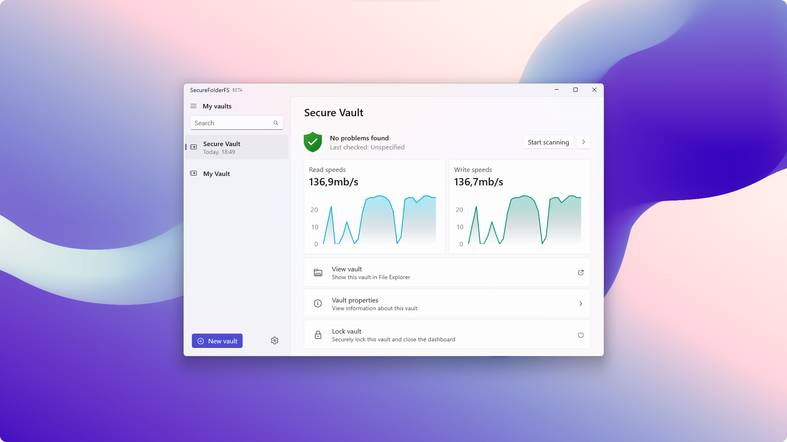

  <h2 align="center">SecureFolderFS</h2>

  

SecureFolderFS helps you keep your files private. Safeguard your data with cutting-edge cryptographic algorithms that seamlessly secure your data thanks to our advanced on-fly encryption.

## Try out SecureFolderFS

You can download and install SecureFolderFS through either of those:
- *[Microsoft Store](https://apps.microsoft.com/store/detail/securefolderfs/9NZ7CZRN7GG8)*
- *[Releases](https://github.com/securefolderfs-community/SecureFolderFS/releases)*

*Installing SecureFolderFS on other platforms is coming in the foreseeable future.*

## Translating SecureFolderFS

You can update existing localization strings by heading to our *[Crowdin project page](https://crowdin.com/project/securefolderfs)*. To add a new language to the list, please request it to be added *[here](https://github.com/securefolderfs-community/SecureFolderFS/issues/50)*. New translations will be synced periodically to the main repository.

## Contributing

We welcome all contributors! Whether you want to suggest a new feature or report a bug, you can open a new *[Issue or Feature Request](https://github.com/securefolderfs-community/SecureFolderFS/issues/new/choose)*. Take a look at our *[Contributing Guidelines](CONTRIBUTING.md)* to learn about best practices when creating a new Pull Request.
